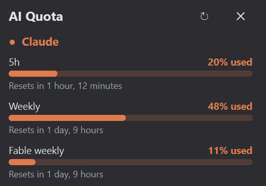

# Quota Monitor

A tray app for Windows and Linux that shows AI usage limits in one panel.

- **Claude**: 5h, weekly and per-model weekly limits
- **Codex**: 5h, weekly and model-specific limits, credits
- **Antigravity**: 5h and weekly limits for the Gemini and Claude/GPT groups
- **Command Code**: 5h, weekly and monthly limits
- **DeepSeek**: prepaid balance
- **OpenCode Go**: 5h, weekly and monthly limits

Claude, Codex and Antigravity are signed in from the tray menu. Command Code, DeepSeek and OpenCode Go use credentials in `.env`.

<p align="center">
  
</p>

## Setup (once)

Requires Python 3.11+. Keep the folder on a local disk.

**Windows (PowerShell, in the project folder):**
```powershell
py -m venv .venv
.venv\Scripts\pip install -r requirements.txt
Copy-Item .env.example .env
```

**Linux Mint:**
```bash
sudo apt install python3-venv libxcb-cursor0
python3 -m venv .venv
.venv/bin/pip install -r requirements.txt
cp .env.example .env
chmod 600 .env
```

Fill in `.env` (see below). Set `enabled = false` in `config.toml` for any provider you don't use.

## Start

- **Windows:** double-click `run_tray.pyw`.
- **Linux:** run `.venv/bin/python run_tray.pyw`. The terminal can be closed afterwards.

The app runs in the background with an icon in the tray. Then, from the tray icon's right-click menu:

1. Choose **Sign in to Claude**, **Sign in to Codex** and **Sign in to Antigravity**. Each opens the browser; log in there. Sign-ins are saved and renewed automatically.
2. Tick **Start at login**.

Left-click the tray icon to open or close the panel. The icon's ring shows the highest usage across all windows.

## Credentials in `.env`

**DeepSeek:** `DEEPSEEK_API_KEY=sk-...`

**Command Code:**
1. Sign in at https://commandcode.ai.
2. Press F12, open the **Network** tab and reload the page.
3. Click a request to `api.commandcode.ai` (for example `credits`).
4. Under **Request Headers**, copy the value of `Cookie`.
5. Set `COMMANDCODE_COOKIE=<copied value>` in `.env` and choose **Refresh now** in the tray menu.

Repeat if the panel reports an expired Command Code session.

**OpenCode Go:**
1. Sign in at https://opencode.ai/console and open the **Go** page.
2. Press F12, open the **Network** tab, select **Fetch/XHR** and reload.
3. Click the `status` request.
4. Under **Request Headers**, copy the `auth=...` part of the `Cookie` value.
5. Set `OPENCODE_COOKIE=auth=<value>` in `.env` and choose **Refresh now** in the tray menu.

Repeat if the panel reports an expired OpenCode session.

## Notes

- Sign-ins are stored in `data/auth/`. Deleting a file there signs that provider out.
- Google's terms prohibit using Antigravity sign-ins in software other than Google's; accounts have been suspended for it.
- The Claude, Codex, Antigravity, Command Code and OpenCode Go endpoints are undocumented and can change. A failing provider shows its error in the panel along with its last known values.
- Errors from the background process are written to `data/tray.log`.
- Moving the project folder: untick and re-tick **Start at login**.
